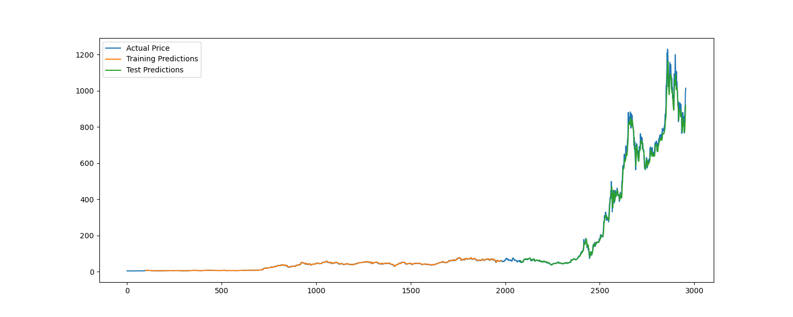

# Tesla Stock Price Prediction Using LSTM

## Overview
This project demonstrates how to predict Tesla's stock prices using a Long Short-Term Memory (LSTM) model with TensorFlow. It includes steps for loading data, preprocessing, model creation, training, evaluation, and visualization of the predictions compared to actual stock prices.

## Requirements
To run this project, you will need the following libraries:
- pandas
- numpy
- scikit-learn
- TensorFlow
- matplotlib

You can install these libraries using pip:
pip install pandas numpy scikit-learn tensorflow matplotlib

## Dataset
The dataset used in this project is Tesla's stock prices obtained from a CSV file named `TSLA.csv`. The CSV file should contain daily stock prices with at least the following columns: `Date`, `Open`, `High`, `Low`, `Close`, `Volume`.

## Usage
1. **Prepare the Data**: Place your `TSLA.csv` file in the project directory.
2. **Run the Code**: Execute the provided Python script to train the LSTM model and predict Tesla's stock prices.
3. **Visualize Predictions**: The script will generate plots showing the actual vs. predicted stock prices.

## Code Structure
- **Data Loading and Preprocessing**: The script starts by loading the Tesla stock price data from a CSV file, focusing on the `Close` prices. The data is then normalized using `MinMaxScaler`.
- **Creating Sequences**: A helper function `create_dataset` is used to create sequences from the time series data, which are used as input for the LSTM model.
- **Model Creation**: An LSTM model is defined using TensorFlow's Keras API, consisting of two LSTM layers followed by two dense layers.
- **Training**: The model is trained on the preprocessed dataset.
- **Prediction and Evaluation**: The script predicts stock prices on the training and test datasets and evaluates the model's performance using RMSE.
- **Visualization**: Finally, the actual vs. predicted prices are plotted using matplotlib.

## Results
After running the script, you will see a plot comparing the actual Tesla stock prices with the predictions made by the LSTM model. The console will also display the RMSE values for both the training and test datasets.

## Customization
You can customize the LSTM model, adjust the sequence length, modify the train-test split ratio, or experiment with different hyperparameters to improve the model's performance.

## License
This project is open-source and available under the MIT license.
